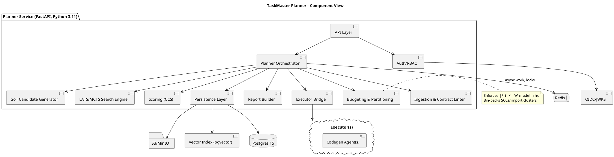
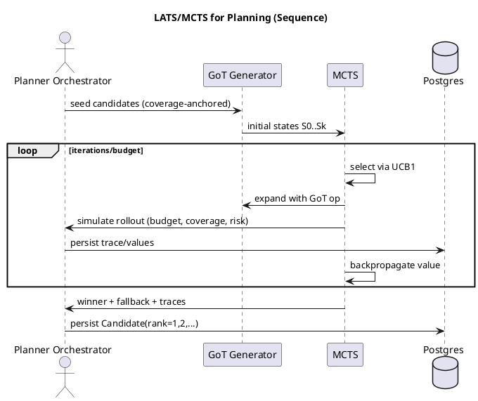
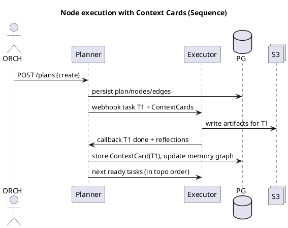

# SPEC-001-TaskMaster Task Planner (Headless)

## Background

**Purpose.** Deliver a **headless planning/orchestration service** that ingests a PRD/spec (plus OpenAPI/GraphQL when present) and emits a **contract‑anchored execution plan**—a dependency‑tracked DAG of atomic tasks—together with **JSON artifacts** for downstream coding agents. The service also **orchestrates** with third‑party code‑generation agents, feeding them compact context via **Context Cards** and capturing their reflections to improve future replans.

**Why now.** Existing planners either (a) over‑coarsen tasks, (b) blow the model context window, or (c) ignore contract coverage and research friction. TaskMaster is designed to **outperform** by combining **Graph‑of‑Thought (GoT)** candidate generation with **Language‑Agent Tree Search (LATS/MCTS)**, a **research‑aware composite complexity score (CCS)**, and **formal context‑window budgeting** with automatic task re‑partitioning. ([arXiv][1])

**Contract‑first.** The **contract (OpenAPI/GraphQL)** is the source of truth for feature coverage and dependency ordering. If no contract is supplied, a **minimal synthesized contract** is generated to anchor planning. **Coverage = 100%** of entities/endpoints referenced.

**Headless & front‑end gating.** The planner exposes **REST APIs only**. If the PRD omits UI/UX, the system **must not** emit FE nodes (front‑end gating).

**Window‑safe by construction.** Every task enforces
$|\mathcal{P}_i| \le W_\text{model} - \rho$ with default $W_\text{model}=200\,000$ tokens and $\rho \in [5\%,10\%]$. If a payload would exceed the bound, the planner **re‑partitions** tasks (bin‑packing SCCs/import clusters) before execution.

**Research‑aware scoring.** Each node’s **CCS$_i\in[0,100]$** blends dependency load, surface area, novelty, ambiguity, and research friction $(D,S,N,A,R)$ with default weights $\{0.30,0.20,0.20,0.15,0.15\}$. Subtask recommendations follow $k_i=\lceil \mathrm{CCS}_i/\tau\rceil$ with $\tau=15$.

**Cross‑task communication.** After each node completes, the system emits a compact **Context Card** (contract slice, interface signatures, schema/version hashes, change summary, citations). Cards are stored in a **Project Memory Graph** (externalized, RAG‑style) so downstream agents can retrieve **only what they depend on**, not full artifacts—keeping context slim.

**Outputs & auditability.** The service returns a **Task List JSON** (id, title, domain, deps, ACs, artifacts, budgets, CCS + 1–10, model class, citations, risk), a **DAG JSON**, and a **Plan Report**. All parameters, weights, headroom, and search traces (visits/values for UCB1) are persisted for **reproducibility and audit**. **LATS/MCTS** selection uses **UCB1**. ([arXiv][2])

**Non‑goals.** No codegen UI, no direct execution of code, no credential scraping, no customer‑facing auth flows.

**Ops posture (defaults).** Python 3.11 / FastAPI planner; Postgres 15 (metadata + pgvector), S3/MinIO (artifacts), Redis (indices); OIDC client‑credentials; observability with OpenTelemetry. FastAPI emits an **OpenAPI 3.1** document and pairs cleanly with Pydantic v2. ([FastAPI][3])

---

## Requirements

### Must‑Have (M)

**Product & Planning**

* **Contract‑first planning**: Import or synthesize OpenAPI/GraphQL and treat as **source of truth**; enforce **100% coverage** of entities/endpoints. *(REQ‑TPL‑INGEST‑002, REQ‑TPL‑METRIC‑001, REQ‑TPL‑SCOPE‑001,002; REQ‑TPL‑ASSUME‑001)*
* **PRD ingestion** (MD/PDF/TXT) extracting headings/glossary/constraints. *(REQ‑TPL‑INGEST‑001)*
* **Front‑end gating**: If PRD/spec lacks UI/UX, **exclude FE nodes**. *(REQ‑TPL‑INGEST‑003, REQ‑TPL‑SCOPE‑004)*
* **DAG construction** across DB/BE/(FE if any)/Test/Package with acyclicity guarantees and merge points. *(REQ‑TPL‑DAG‑001..004, REQ‑TPL‑ARCH‑002)*
* **Node cardinality scaling (unbounded)**: The planner may emit **as many tasks per domain as needed** to satisfy coverage, window budgeting, and acyclicity. Examples: one project may have **2\:DB, 10\:BE, 8\:FE** nodes; another may have **20\:DB, 100\:BE, 80\:FE** nodes—still meeting SLOs/window constraints. *(REQ‑TPL‑DAG‑001..004, REQ‑TPL‑PERF‑003, REQ‑TPL‑BUDGET‑001..003)*
* **Candidate generation (GoT)**: ≥3 candidate DAGs with contract coverage; **LATS/MCTS** search, UCB1, persisted traces; **winner + fallback**. *(REQ‑TPL‑PLAN‑001..002)*
* **Research‑aware Complexity Scoring (CCS)** with $D,S,N,A,R$ components, defaults $w=\{0.30,0.20,0.20,0.15,0.15\}$, subtask advice $k_i=\lceil \mathrm{CCS}_i/15\rceil$, task horizon + confidence. *(REQ‑TPL‑CPLX‑001..003)*
* **Window budgeting** per task with headroom $\rho\in[5\%,10\%]$ and automatic **re‑partitioning** when limits would be exceeded; compute $T_i^{\max}$. *(REQ‑TPL‑BUDGET‑001..003)*

**Outputs & Orchestration**

* **Task List JSON only (no code)** with fields: ids, domains, descriptions, deps, ACs, artifactsIn/Out, token budgets, complexity (0–100 and 1–10), recommended subtasks, confidence, modelClass, citations, riskClass. *(REQ‑TPL‑OUT‑001)*
* **DAG JSON** and **Plan Report** (JSON + optional HTML). *(REQ‑TPL‑OUT‑002; GET endpoints)*
* **Repo Scaffold request** must appear in initial tasks; paths referenced thereafter. *(REQ‑TPL‑OUT‑003)*
* **Cross‑task communication** via **Context Cards** and **Project Memory Graph**; downstream tasks retrieve only needed cards. *(REQ‑TPL‑COMM‑001..004)*
* **Planner ↔ executor orchestration** (headless): planner emits Context Cards + instructions; receives executor reflections; stores reflections for replans. *(§1 + §5.7 intent)*

**API & Security**

* **REST API** with endpoints: `POST /plans`, `GET /plans/{id}`, `GET /plans/{id}/graph`, `GET /plans/{id}/tasks.json`, `GET /plans/{id}/report`, `POST /plans/{id}/rerun`. *(§8.2)*
* **OpenAPI 3.1** docs; error envelope with remediation; correlation IDs. *(REQ‑TPL‑API‑001,‑DOC‑001; FastAPI 3.1 support) ([FastAPI][4])*
* **Auth**: OIDC client‑credentials; bearer JWT validation; RBAC (ORCH/TL/ADM). *(REQ‑TPL‑AUTH‑001..003, REQ‑TPL‑ROLE‑*)\*
* **Transport/security**: TLS 1.3; AES‑256 at rest; least privilege; rate limits; circuit breakers; request size caps; mTLS optional. *(§4.2)*

**Data & Audit**

* **Primary DB**: Postgres 15, UUIDv4 PKs; entities Plan/Node/Edge/Candidate/ContextCard/ScoreCard/AuditLog; FK integrity; **DAG acyclicity on save**. *(§6.1, §11.1–11.2, REQ‑TPL‑DATA‑005)*
* **Migrations**: automated, versioned snapshots with checksums; rollback. *(REQ‑TPL‑DATA‑006)*
* **Audit trail**: parameter/weights/headroom/search traces retained ≥2y; exportable. *(REQ‑TPL‑AUDIT‑001, §14.2)*
* **Retention**: soft delete with `deletedAt`. *(REQ‑TPL‑DELETE‑001)*

**Non‑functional**

* **Performance**: Plan creation ≤ **10 min p95** (medium, 30–50 endpoints); ≤ **15 min p95** (large). Retrieval ≤ **500 ms p95**; report ≤ **2 s p95**. *(§9.1)*
* **Scalability**: ≥10 concurrent runs (Beta); ≥20 medium PRDs/day; queue back‑pressure & fair scheduling. *(§9.2)*
* **Reliability**: 99.5% uptime (Beta) / 99.9% (GA); RTO ≤ 4h; RPO ≤ 15m; backups + PITR. *(§9.3)*
* **Obs/Cost**: metrics (wall‑time, candidates, depth/width, tokens, coverage, CCS, replans), tracing, structured logs, token/time budgets with abort thresholds. *(§9.4)*

**Tech/Deploy**

* **Stack defaults**: Python 3.11 + FastAPI planner; storage: **Postgres 15 (metadata & pgvector for memory)**, **S3/MinIO** (artifacts), **Redis** (indices/locks). *(§10.1; pgvector HNSW/IVFFlat) ([GitHub][5])*
* **Clean separation** of scoring/search/persistence/reporting; content‑hash artifact IDs. *(§10.2)*
* **Kubernetes** deploy (dev/stage/prod), env‑var config validation, secrets via vault, HPA, probes; CI/CD with approvals; OTEL + Prometheus/Grafana. *(§10.3; FastAPI OTEL) ([OpenTelemetry Python Contrib][6])*

---

### Should‑Have (S)

* **Model headroom policy** configurable per plan (5–10%); dynamic model routing by CCS bands.
* **Allow‑listed research** when `allowResearch=true`, automatic citation attachment, and integration of research signals into **N** and **R**.
* **Synthesized minimal contract** when absent, with lint‑clean guarantees.
* **Cost/throughput guardrails** (rate limits per org/project) and schedule fairness.
* **Optional HTML Plan Report** for offline review.

### Could‑Have (C)

* **Alternate API surface** (GraphQL read‑only mirror) for plan/report retrieval.
* **Multi‑model A/B** on planner prompts or search constants (e.g., UCB1 `c`) to tune win‑rates.
* **Event bus integration** (NATS/Kafka) for high‑volume executor streaming beyond webhooks/polling.
* **Coverage diff visualizer** (artifact) and contract‑driven risk map.

### Won’t‑Have (W) — v1

* **No code generation/execution** in the planner; no UI; no credential scraping; no customer‑facing auth flows.

---

## Method

### M0. High‑level design (contract‑anchored, window‑safe by construction)

**Flow.**
PRD/Contract Ingest → Contract Lint/Synthesize → Coverage Extract → **GoT** candidate graph ops → **LATS/MCTS** search & scoring → **Winner + Fallback** plan → Persist DAG/Tasks/Context Cards → Orchestrate executor via webhooks (Context Cards in/out) → Report & Audit. ([arXiv][1])

**Core principles.**

1. **Contract‑first & coverage‑complete.** Map all endpoints/entities in supplied or synthesized OpenAPI/GraphQL to tasks; coverage diff must be zero.
2. **Front‑end gating.** If the PRD lacks UI/UX, the FE pipeline is not generated.
3. **Unbounded node counts.** Planner may emit as many tasks per domain as necessary (e.g., `2:DB,10:BE,8:FE` or `20:DB,100:BE,80:FE`) while meeting SLOs and window constraints.
4. **Window budgeting.** Enforce $|\mathcal{P}_i|\le W_\text{model}-\rho$; auto‑repartition if violated.
5. **Research‑aware scoring.** CCS blends $D,S,N,A,R$ components.

**Stack selections (proven, current).**

* **Planner API:** **FastAPI** with **Pydantic v2**; emits **OpenAPI 3.1** (JSON Schema 2020‑12). ([FastAPI][3])
* **ORM/DB:** **SQLAlchemy 2.x** async over **Postgres 15**. ([SQLAlchemy][7])
* **Vector search:** **pgvector** (HNSW/IVFFlat) for Project Memory Graph. ([GitHub][5])
* **Async Redis client** for indices/locks/queues (`redis-py` asyncio). ([Redis Documentation][8])
* **Artifacts:** S3/MinIO via **aioboto3** (async) or MinIO SDK. ([AioBoto3][9])
* **Observability:** OpenTelemetry instrumentation for FastAPI. ([OpenTelemetry Python Contrib][6])

---

### M1. Component architecture



---

### M2. Data model (Postgres 15 + pgvector)

> UUIDv4 PKs; created/updated timestamps; all FKs `ON DELETE RESTRICT`. **pgvector** stores Context‑Card embeddings; HNSW index (cosine) for fast retrieval. ([GitHub][5])

**DDL (contractor‑ready excerpts):**

```sql
CREATE EXTENSION IF NOT EXISTS "uuid-ossp";
CREATE EXTENSION IF NOT EXISTS vector;  -- pgvector

CREATE TABLE plan (
  id            uuid PRIMARY KEY DEFAULT uuid_generate_v4(),
  project_id    uuid NOT NULL,
  run_id        uuid NOT NULL,
  contract_hash text NOT NULL,
  status        text NOT NULL CHECK (status IN ('Draft','Winning','Fallback')),
  score         numeric(5,2),
  wall_time_ms  bigint,
  token_cost    bigint,
  params        jsonb NOT NULL,
  report_ref    text,
  created_at    timestamptz NOT NULL DEFAULT now(),
  updated_at    timestamptz NOT NULL DEFAULT now(),
  UNIQUE(project_id, run_id)
);

CREATE TABLE plan_node (
  id             uuid PRIMARY KEY DEFAULT uuid_generate_v4(),
  plan_id        uuid NOT NULL REFERENCES plan(id),
  type           text NOT NULL CHECK (type IN ('DB','BE','FE','Test','Package','Data-Pipeline')),
  label          text NOT NULL,
  instructions   jsonb NOT NULL,        -- structured guidance (no code)
  artifacts_in   jsonb NOT NULL DEFAULT '[]',
  artifacts_out  jsonb NOT NULL DEFAULT '[]',
  token_budget   integer NOT NULL,      -- planned |P_i|
  score          jsonb NOT NULL,        -- CCS + components
  order_hint     integer,
  summary        text
);

CREATE TABLE plan_edge (
  id          uuid PRIMARY KEY DEFAULT uuid_generate_v4(),
  plan_id     uuid NOT NULL REFERENCES plan(id),
  from_node   uuid NOT NULL REFERENCES plan_node(id),
  to_node     uuid NOT NULL REFERENCES plan_node(id),
  artifact_type text,
  description text,
  CONSTRAINT no_self_dep CHECK (from_node <> to_node)
);

CREATE TABLE plan_candidate (
  id          uuid PRIMARY KEY DEFAULT uuid_generate_v4(),
  plan_id     uuid NOT NULL REFERENCES plan(id),
  rank        integer NOT NULL,             -- 1=winner
  value       numeric(6,3) NOT NULL,        -- search value
  params      jsonb NOT NULL,
  trace       jsonb NOT NULL,
  UNIQUE(plan_id, rank)
);

CREATE TABLE context_card (
  id                uuid PRIMARY KEY DEFAULT uuid_generate_v4(),
  node_id           uuid NOT NULL REFERENCES plan_node(id),
  contract_slice_ref text NOT NULL,
  interfaces        jsonb NOT NULL,
  schema_hashes     jsonb NOT NULL,
  summary           text NOT NULL,
  citations         jsonb NOT NULL DEFAULT '[]',
  embedding         vector(1536),
  created_at        timestamptz NOT NULL DEFAULT now()
);
CREATE INDEX ON context_card USING hnsw (embedding vector_cosine_ops);

CREATE TABLE complexity_features (
  node_id     uuid PRIMARY KEY REFERENCES plan_node(id),
  d           numeric(5,2) NOT NULL,
  s           numeric(5,2) NOT NULL,
  n           numeric(5,2) NOT NULL,
  a           numeric(5,2) NOT NULL,
  r           numeric(5,2) NOT NULL,
  ccs         numeric(5,2) NOT NULL,
  recommended_subtasks integer NOT NULL,
  confidence  numeric(3,2) NOT NULL CHECK (confidence BETWEEN 0 and 1)
);

CREATE TABLE audit_log (
  id            uuid PRIMARY KEY DEFAULT uuid_generate_v4(),
  principal     text NOT NULL,
  action        text NOT NULL,
  old_val       jsonb,
  new_val       jsonb,
  correlation_id uuid NOT NULL,
  created_at    timestamptz NOT NULL DEFAULT now()
);
```

**Acyclicity on save.** Deferred trigger rejects any new edge that introduces a cycle (Kahn/Tarjan basis).

```sql
CREATE OR REPLACE FUNCTION check_cycle() RETURNS trigger AS $$
BEGIN
  IF EXISTS (
    WITH RECURSIVE reach(n) AS (
      SELECT NEW.to_node
      UNION
      SELECT e.to_node FROM plan_edge e JOIN reach r ON e.from_node = r.n WHERE e.plan_id = NEW.plan_id
    )
    SELECT 1 FROM reach WHERE n = NEW.from_node
  ) THEN
    RAISE EXCEPTION 'Cycle detected: % -> %', NEW.from_node, NEW.to_node;
  END IF;
  RETURN NEW;
END$$ LANGUAGE plpgsql;

CREATE CONSTRAINT TRIGGER plan_edge_acyclic
AFTER INSERT ON plan_edge DEFERRABLE INITIALLY DEFERRED
FOR EACH ROW EXECUTE FUNCTION check_cycle();
```

*(Tarjan’s SCC and Kahn’s topological sort are the underlying references.)* ([Wikipedia][10])

---

### M3. Ingestion & contract anchoring

1. **PRD parse** (MD/PDF/TXT): headings, glossary, constraints, requirement IDs.
2. **Contract ingest** (OpenAPI 3.1 or GraphQL SDL). Validate with **openapi‑spec‑validator** / **openapi‑schema‑validator** when OpenAPI present. ([OpenAPI Spec Validator][11])
3. **Synthesize minimal contract** if missing: endpoints inferred from PRD entities/actions; emit OpenAPI 3.1 skeleton; operationIds align to task IDs for traceability. ([Swagger][12])
4. **Coverage set**: entities, endpoints, DTOs, tables derived from contract; **FE gating** checked against PRD/UI presence flag.

---

### M4. Dependency detection → initial graph

* **DB domain:** Build table/foreign‑key graph; compute **SCCs** (Tarjan) to co‑locate mutually referencing migrations. ([Wikipedia][10])
* **BE domain:** Build import/interface graph from contract (routes/DTOs/clients). Group nodes by import clusters.
* **FE domain (if any):** Emit global primitives (theme, layout, typed API client), then pages/routes in parallel.
* **Merge points:** Integration test & packaging nodes mark joins.
* **Acyclicity:** Check on save (trigger) + Kahn topological order. ([Wikipedia][13])

---

### M5. Complexity Scoring (CCS) and decomposition

$$
\text{CCS}_i = 0.30 D_i + 0.20 S_i + 0.20 N_i + 0.15 A_i + 0.15 R_i
$$

**Feature extraction (normalized \[0,1]):**

* $D_i$: scaled in/out‑degree, SCC size, cross‑domain edges.
* $S_i$: counts of API ops, table columns, DTO fields, test cases.
* $N_i$: cosine distance to nearest **Pattern Library** embedding (pgvector). ([GitHub][5])
* $A_i$: entropy of PRD span, unresolved terms.
* $R_i$: allow‑listed external docs to consult; penalize pages/tokens needed.

**Normalization:** robust quantiles per plan (`q10`/`q90` → clip \[0,1]).

**Decomposition:** $k_i=\lceil \mathrm{CCS}_i/15\rceil$. Split along **dependency‑coherent** seams (SCCs/import clusters/FE sections).

**Bands & model mapping (policy):**

| CCS    | Default Model Class     | Notes                                      |
| ------ | ----------------------- | ------------------------------------------ |
| 0–40   | Class‑200K              | Small/simple; tight budgets                |
| 41–80  | Class‑200K              | May need extra headroom                    |
| 81–100 | Class‑1M (if available) | Or auto‑split if $T_i^{\max}$ insufficient |

---

### M6. Window budgeting & partitioning

$$
|\mathcal{P}_i|=|h|+|s|+|\iota_i|+|c_i|+|m_i|+|e_i|+|a_i|\le W_\text{model}-\rho,\qquad
T_i^{\max}=W_\text{model}-\rho-(|h|+|s|+|\iota_i|+|c_i|+|a_i|)
$$

**Token estimation.** Use the selected model’s tokenizer; fallback to **tiktoken** and **Hugging Face tokenizers** when model‑specific encoding is unknown. ([GitHub][14])

**Partitioning algorithm.**

1. Compute SCCs/import clusters.
2. Treat each cluster as an “item”; **bin‑pack** into bins of capacity $T_i^{\max}$ using **FFD (First‑Fit Decreasing)**; fallback to Best‑Fit if needed. ([Wikipedia][15])
3. If any single cluster exceeds capacity, **split by interface boundary** and retry.
4. Emit new nodes; rewire edges; re‑compute budgets.

---

### M7. Candidate graph generation (GoT) & search (LATS/MCTS)

**Graph‑of‑Thought operations** (plan‑graph actions):

* `ADD_NODE(domain, payload)`
* `SPLIT_NODE(node, cutset)` (dependency‑coherent)
* `MERGE_NODES(nodes)` (under‑utilized budget)
* `REWIRE_EDGE(u→v, u→w)` (preserve acyclicity)
* `ANNOTATE_NODE(node, horizon/confidence/modelClass)`
* `ATTACH_CARD(node, contract_slice)`

**Search:** **LATS/MCTS** with **UCB1** selection

$$
UCB_i=\overline{X}_i+c\sqrt{\frac{\ln N}{n_i}},\quad c\approx\sqrt{2}
$$

**State:** partial plan; **Action:** GoT op; **Terminal:** coverage==100%, acyclic, all windows satisfied. **Rollout value** blends coverage (hard), budget slack, mean CCS penalty, expected tokens/time, and risk. Persist visits/values/params for audit. ([arXiv][2])



---

### M8. Orchestration & cross‑task memory

**Context Cards** (after each node): contract slice, interfaces/DTO signatures, schema/version hashes, “what changed”, brief rationale, citations, and an **embedding** for retrieval. Store in Postgres with **pgvector**; index with **HNSW** for cosine similarity. ([GitHub][5])

**Project Memory Graph:** directed graph where edges mirror plan dependencies; retrieval pulls **only upstream cards** required by a node (plus the repo‑scaffold reference), keeping contexts slim.

**Executor Bridge:**

* **Outbound → Executor**: webhook payload `{task, contextCards[], budget, modelClass}`.
* **Inbound ← Executor**: `{taskId, artifactsOut[], reflections[], citations[]}`.
* **Artifacts**: write to S3/MinIO via **aioboto3** or MinIO SDK; **content‑hash** IDs. ([AioBoto3][9])



---

### M9. JSON output contracts

**Task List JSON (per §5.6)** — each entry:

```json
{
  "id": "uuid",
  "title": "string",
  "domain": "DB|BE|FE|Test|Package|Data-Pipeline",
  "description": "string",
  "requirementsRefs": ["REQ-..."],
  "dependencies": ["uuid", "..."],
  "acceptanceCriteria": ["..."],
  "artifactsIn": [{"ref":"s3://...", "type":"contract|card|schema"}],
  "artifactsOut": [{"ref":"s3://...", "type":"card|artifact"}],
  "contextBudgetTokens": 180000,
  "complexity": {
    "score_0_100": 72.5,
    "score_1_10": 7,
    "recommendedSubtasks": 5,
    "confidence": 0.78
  },
  "modelClass": "Class-200K|Class-1M",
  "citations": ["..."],
  "riskClass": "Low|Medium|High"
}
```

**DAG JSON:** nodes/edges with topological order and merge points.
**Plan Report:** aggregates (coverage diff, CCS distribution, budget slack, candidate traces, reflections).

---

### M10. Algorithms (pseudo‑code)

**A. CCS computation**

```text
for node in nodes:
  D = norm(deg_in_out(node) + cross_domain_edges(node) + scc_size(node))
  S = norm(api_ops(node) + dto_fields(node) + table_cols(node) + ui_widgets(node))
  N = norm(cosine_distance(embedding(node), nearest_pattern_embedding))
  A = norm(entropy(prd_slice(node)) + unresolved_terms_count(node))
  R = norm(research_docs_needed(node) ? pages(tokens) : 0)
  CCS = 0.30*D + 0.20*S + 0.20*N + 0.15*A + 0.15*R
  k = ceil(CCS / 15)
  band = band_for(CCS)
  model = route_by(band, T_max(node))
```

**B. Budgeting & partitioning**

```text
for node in nodes:
  estimate_tokens = tokens(h, s, iota(node), c(node), m(node), e(node), a(node))
  if estimate_tokens > W_model - rho:
    clusters = scc_or_import_clusters(node)
    bins = FFD_pack(clusters, capacity = T_max(node))   # First-Fit Decreasing
    if any(cluster.size > capacity): split_by_interface(cluster)
    replace node with packed subtasks; rewire edges
```

**C. GoT + LATS/MCTS loop**

```text
init candidates = seed_from_contract()
while budget_not_exhausted:
  s = select_ucb1(tree)
  a = choose_got_op(s)
  s2 = apply(a, s)        # maintain coverage + acyclicity
  v = rollout_value(s2)   # coverage, budgets, CCS slack, risk
  backpropagate(s2, v)
return best + fallback
```

---

### M11. Security & auth (method specifics)

* **OIDC Client Credentials.** Validate JWTs via **JWKS**; verify `aud`, `iss`, `exp`; map IdP roles → `ORCH/TL/ADM`. Libraries such as **Authlib** support JWKS‑backed decoding and claims validation. ([Authlib][16])
* **Transport**: TLS 1.3; **mTLS** intra‑cluster optional.
* **Request caps**: payload size & rate limits (per org); circuit breakers.
* **Webhooks**: HMAC‑SHA256 signatures + idempotency keys.

---

## Implementation

### I1. Repo scaffold (also emitted as the first “Repo Scaffold” task)

```
taskmaster-planner/
├─ services/planner/
│  ├─ app/__init__.py
│  ├─ app/api/                # FastAPI routers
│  │  ├─ plans.py             # POST/GET/rerun/report/graph
│  │  └─ executor_callbacks.py
│  ├─ app/auth/oidc.py        # JWT/JWKS, role mapping
│  ├─ app/domain/             # core modules
│  │  ├─ ingest.py            # PRD + contract ingest/lint/synthesize
│  │  ├─ coverage.py          # coverage set & diff computation
│  │  ├─ deps_db.py           # DB graph (FK, SCCs)
│  │  ├─ deps_be.py           # import/interface graph
│  │  ├─ deps_fe.py           # FE (gated) graph emit
│  │  ├─ ccs.py               # complexity features + score
│  │  ├─ budget.py            # token budgets & partitioning
│  │  ├─ got_ops.py           # Graph-of-Thought operations
│  │  ├─ lats_mcts.py         # search engine (UCB1)
│  │  ├─ cards.py             # Context Cards (create/retrieve)
│  │  └─ report.py            # JSON/HTML summary
│  ├─ app/persistence/
│  │  ├─ db.py                # SQLAlchemy async engine/session
│  │  ├─ models.py            # ORM models
│  │  ├─ dag_guard.py         # acyclicity trigger install
│  │  └─ storage.py           # S3/MinIO, content-hash IDs
│  ├─ app/observability/otel.py
│  ├─ app/config.py           # pydantic-settings, schema validation
│  └─ main.py                 # FastAPI app init (OpenAPI 3.1)
├─ migrations/                # Alembic
├─ infra/
│  ├─ helm/                   # chart with values.yaml
│  ├─ k8s/                    # manifests
│  └─ terraform/              # optional: RDS/S3/Redis
├─ tests/                     # API, scoring, budgeting, search
├─ openapi/                   # frozen OpenAPI 3.1 JSON for docs
├─ scripts/                   # dev: seed, migrate, smoke
└─ requirements.txt           # pinned deps
```

**Key libraries (stable, as of Sep 2025):**

* **FastAPI** (emits **OpenAPI 3.1**, Pydantic v2 compatible). ([FastAPI][4])
* **SQLAlchemy 2.x** async engine (`create_async_engine`). ([SQLAlchemy][7])
* **redis‑py** with asyncio support. ([Redis][17])
* **pgvector** extension (HNSW/IVFFlat indices). ([GitHub][5])
* **aioboto3** (async S3) or **MinIO Python SDK**. ([AioBoto3][9])
* **OpenTelemetry FastAPI instrumentation**. ([OpenTelemetry Python Contrib][6])
* Tokenizers: **tiktoken** and **Hugging Face tokenizers**. ([GitHub][14])

> FastAPI generates **OpenAPI 3.1**; if a downstream tool requires 3.0.x, you may override the version string or provide a 3.0‑compatible schema subset (feature‑reduced) via app init. ([FastAPI][4])

---

### I2. Configuration (env‑schema validated)

`app/config.py` (Pydantic v2 settings):

* **Auth & RBAC**: `OIDC_ISSUER_URL` (JWKS discovery), `OIDC_AUDIENCE`, `ROLE_CLAIM` (e.g., `roles`), `ROLE_MAP` (`ORCH|TL|ADM`). ([Authlib][18])
* **Planner**: `DEFAULT_MODEL_CLASS=Class-200K`, `OPTIONAL_MODEL_CLASS=Class-1M`, `WINDOW_HEADROOM_PCT=0.10`, `ALLOW_RESEARCH=false`, `UCB1_C=1.414`, `SEARCH_MAX_ITERS`, `SEARCH_WALLTIME_MS`.

  * **Unbounded nodes policy:** no hard cap; **safety fuse** `ABORT_IF_NODES_GT=10000`.
* **Storage**: `DATABASE_URL` (Postgres 15), `PGVECTOR_ENABLED=true`, `REDIS_URL`, `S3_ENDPOINT`, `S3_BUCKET`, `S3_REGION`.
* **Security**: `WEBHOOK_HMAC_SECRET`, `MAX_REQ_BYTES`, per‑org `RATE_LIMIT_QPS`.
* **Observability**: `OTEL_EXPORTER_OTLP_ENDPOINT`, `OTEL_SERVICE_NAME="taskmaster-planner"`. ([OpenTelemetry][19])

---

### I3. API (OpenAPI 3.1 excerpts)

**POST `/plans`** — create plan
Request includes: `projectId`, `runId`, `prdRef`, optional `contractRef`, `modelClass`, `windowHeadroomPct(0.05..0.10)`, `allowResearch`, `weights{wD,wS,wN,wA,wR}`, `limits{searchMaxIters,searchWallTimeMs}`, `seed`.
Responses: `202 Accepted` → `{ planId, status }`.

**GET `/plans/{id}`** — plan summary (status, coverage, scores, budgets).
**GET `/plans/{id}/graph`** — DAG JSON.
**GET `/plans/{id}/tasks.json`** — Task List JSON (see §M9).
**GET `/plans/{id}/report`** — report metadata + signed URLs.
**POST `/plans/{id}/rerun`** — rerun with overrides.

**POST `/executor/callbacks/{taskId}`** — executor webhook (HMAC + idempotency)
Headers: `X-Signature: sha256=<hex>`, `X-Idempotency-Key: <uuid>`
Body: `{status, artifactsOut[], reflections[], citations[]}`

---

### I4. Persistence & migrations

* **SQLAlchemy 2.x async** engine to Postgres 15; **Alembic** for migrations. ([SQLAlchemy][7])
* Enable **pgvector**; create **HNSW** index on `context_card.embedding`. ([GitHub][5])
* Install **acyclicity** trigger (see §M2 SQL).
* Store **DDL checksum** artifacts in S3/MinIO (content‑hash IDs). ([AWS Documentation][20])

---

### I5. Ingestion & FE gating

1. Parse PRD (MD/PDF/TXT) → headings/glossary/constraints/IDs.
2. Load OpenAPI 3.1 / GraphQL; validate OpenAPI via **openapi‑spec‑validator** + **openapi‑schema‑validator**. ([OpenAPI Spec Validator][11])
3. If no contract, **synthesize** OpenAPI 3.1 skeleton (operationIds ↔ tasks).
4. Determine FE presence: explicit flag or heuristic scan for UI terms; if absent, **omit FE nodes**.

---

### I6. Coverage & DAG build

* Build **coverage set** (entities/endpoints/DTOs/tables) from contract.
* **DB graph**: FK edges; compute **SCCs**; co‑locate cyclic migrations. ([Wikipedia][10])
* **BE graph**: import/interface clusters from operations & DTOs.
* **FE graph (if applicable)**: global primitives → pages/routes in parallel.
* **Merge points**: integration tests & packaging.
* **Acyclicity**: enforce via DB trigger; topo order via **Kahn**. ([Wikipedia][13])

---

### I7. Complexity Scoring (CCS) implementation

* Compute normalized $D,S,N,A,R$; default weights.
* $N$: cosine distance to nearest Pattern Library embedding in **pgvector**. ([GitHub][5])
* $A$: entropy + unresolved terms in PRD spans.
* $R$: pages/tokens from allow‑listed docs (if `allowResearch=true`).
* Export **1–10 view** and **confidence** per node.

---

### I8. Window budgeting & partitioning

* **Token counting**: model tokenizer; fallbacks **tiktoken** / **HF tokenizers**. ([GitHub][14])
* Enforce $|\mathcal{P}_i|\le W_{\text{model}}-\rho$; compute $T_i^{\max}$.
* **FFD** bin‑packing of clusters; split‑by‑interface if any cluster exceeds capacity. ([Wikipedia][15])

---

### I9. Candidate generation & search

* Seed ≥3 GoT variants (merge/split/rewire/annotate).
* **MCTS** with **UCB1**; rollout value blends coverage, budgets, CCS slack, risk, expected tokens/time. Persist visits/values/params. ([Wikipedia][21])
* Return **winner + fallback**; keep all candidates for audit.

---

### I10. Executor orchestration

* **Outbound → Executor**: `{task, contextCards[], budget, modelClass}`.
* **Inbound ← Executor**: artifacts + reflections + citations.
* **Idempotency**: dedupe by `(taskId, X-Idempotency-Key)`.
* **Artifacts** to S3/MinIO via **aioboto3** or **MinIO SDK**; use **content‑hash** (SHA‑256) IDs. ([AioBoto3][9])

---

### I11. Observability & SLOs

* **Traces/metrics/logs**: OpenTelemetry FastAPI instrumentation; export OTLP. ([OpenTelemetry Python Contrib][6])
* **Key metrics**: wall‑time, candidate count, DAG depth/width, token budgets & consumption, coverage (0/1), CCS distribution, replan triggers.
* **Alerts**: p95 plan runtime breach; aborted runs (token/time guardrails); webhook failure rates.

---

### I12. Security hardening

* **OIDC** Client Credentials: validate JWT via **JWKS**; verify `iss`, `aud`, `exp`; map IdP roles → `ORCH|TL|ADM`. ([Authlib][18])
* **Transport**: TLS 1.3; optional mTLS in cluster.
* **API gates**: per‑org rate limits, payload caps, circuit breakers.
* **Webhook HMAC** + **idempotency** on server side.
* **Audit**: persist principal, action, old/new, correlationId; retain ≥2 years.

---

### I13. CI/CD & deployment

* **CI**: lint, type‑check, tests, OpenAPI schema check, Alembic dry‑run, image build.
* **CD**: Helm deploy to **Kubernetes** with HPA, PDB, probes; secrets via vault; per‑env configs (headroom %, research allow‑list, model routing).
* **State**: Postgres 15, Redis, S3/MinIO provisioned per env.

---

## Milestones

**Conventions:** Each milestone has a **Gate** (acceptance), **Artifacts**, **Trace** (PRD IDs), and **Perf guardrails** (validate unbounded node counts such as `20:DB,100:BE,80:FE` within SLOs).

* **M0 — Bootstrap & envs**: repo scaffold, CI, Postgres+pgvector, Redis, S3/MinIO, OTEL.
  **Gate:** `/healthz` OK; traces visible; migrations applied.

* **M1 — Persistence & data model**: entities + acyclicity trigger + HNSW index.
  **Gate:** CRUD tests; cycle insertion rejected; audit retention set.

* **M2 — Ingestion & contract anchoring (+ FE gating)**.
  **Gate:** Coverage diff = 0 on fixtures (with/without FE); synthesized OpenAPI lint‑clean.

* **M3 — Dependency detectors & initial DAG**.
  **Gate:** Acyclic DAGs across fixtures; merge points flagged.

* **M4 — CCS v1**: features, normalization, weights, 1–10 view, $k_i$.
  **Gate:** Deterministic scores (fixed seed); monotonic sanity suite.

* **M5 — Window budgeting & partitioning**.
  **Gate:** Heavy task auto‑splits until all nodes satisfy $|\mathcal{P}_i|\le W-\rho$.

* **M6 — GoT candidates & LATS/MCTS search**.
  **Gate:** ≥3 candidates; winner+fallback; traces persisted; seed reproducible.

* **M7 — APIs & outputs**.
  **Gate:** Conformance tests; error envelopes with remediation; JSON contracts validated.

* **M8 — Orchestration bridge** (Planner ↔ Executor).
  **Gate:** E2E happy path: executor receives task+cards, returns artifacts+reflections; cards retrievable.

* **M9 — Observability & cost controls**.
  **Gate:** Dashboards online; alert on synthetic SLO breach; aborted run logged with root cause.

* **M10 — Security & RBAC**.
  **Gate:** Role‑gated endpoints; pen‑test checklist; audit exports.

* **M11 — Scale & soak (unbounded nodes)**.
  **Gate:** p95 ≤10 min (medium) / ≤15 min (large); success on **high node counts**.

* **M12 — Pre‑GA hardening & compliance**.
  **Gate:** DR drills (RTO≤4h, RPO≤15m); SBOM/vuln scans pass thresholds.

* **M13 — GA readiness & handover**.
  **Gate:** RTM coverage=100%; ops handbook; on‑call/training complete.

---

## Gathering Results

### GR1. Evaluation protocol

* **Per‑run**: **Plan Report (JSON)** with coverage diff, DAG width/depth, node counts by domain, CCS distribution, window budgets/slack, candidate traces, citations, reflections; **Task List JSON**; **DAG JSON**; (if executed) executor callback stats.
* **Nightly**: SLO rollups; token/cost envelope; coverage/window violations (should be zero); node cardinality distributions.
* **Release**: RTM (requirements ↔ tasks); A/B on planner knobs (weights, UCB1 constant, partitioning policy).

### GR2. KPIs & targets

| KPI                              | Definition                                        | Target                                       |                           |          |
| -------------------------------- | ------------------------------------------------- | -------------------------------------------- | ------------------------- | -------- |
| **Coverage diff**                | `missing_ops + missing_entities` vs. contract     | **= 0**                                      |                           |          |
| **Avg node confidence** $\bar S$ | Mean `complexity.confidence` in winning plan      | **≥ 0.75**                                   |                           |          |
| **Window compliance**            | % nodes with (                                    | \mathcal{P}\_i                               | \le W\_\text{model}-\rho) | **100%** |
| **Plan runtime p95**             | `/plans` accepted → winner selected               | **≤ 10 min** (medium) / **≤ 15 min** (large) |                           |          |
| **Search efficiency**            | Candidate expansions/min                          | Non‑regressing ↑ trend                       |                           |          |
| **Node cardinality SLO**         | Large fixtures (e.g., `20:DB,100:BE,80:FE`)       | **Pass**                                     |                           |          |
| **Orchestration reliability**    | Webhook success rate                              | **≥ 99.5%**                                  |                           |          |
| **Memory retrieval precision**   | % retrieved Context Cards actually consumed       | **≥ 95%**                                    |                           |          |
| **Research discipline**          | % external citations from allow‑list when enabled | **100% allow‑listed**                        |                           |          |

### GR3. Plan Report (JSON) — minimal schema

```json
{
  "planId": "uuid",
  "summary": {
    "nodesByDomain": {"DB": 20, "BE": 100, "FE": 80, "Test": 12, "Package": 2},
    "dag": {"depth": 14, "widthP95": 9, "acyclic": true},
    "coverage": {"missingOps": 0, "missingEntities": 0},
    "runtimeMs": 471233,
    "tokens": {"planned": 9200000, "estimatedCostUSD": 123.45},
    "search": {"candidates": 7, "winnerRank": 1, "fallbackRank": 2}
  },
  "ccs": {"mean": 61.8, "p90": 82.1, "confidenceMean": 0.79, "bands": {"0_40": 32, "41_80": 156, "81_100": 14}},
  "window": {"headroomPct": 0.10, "compliant": true, "violations": []},
  "orchestration": {"webhooks": {"sent": 310, "success": 309, "retries": 1, "idempotentDrops": 2}},
  "citations": [{"url": "…", "nodeId": "uuid"}],
  "reflections": ["Split high‑SCC DB migration into 3 parts to satisfy T_max."]
}
```

### GR4. DB checks (examples)

**Coverage diff (operations):**

```sql
WITH ops AS (
  SELECT jsonb_array_elements(params->'contractIndex'->'operations')->>'operationId' AS op_id
  FROM plan WHERE id = :plan_id
),
mapped AS (
  SELECT DISTINCT jsonb_array_elements_text(instructions->'contractOps') AS op_id
  FROM plan_node WHERE plan_id = :plan_id
)
SELECT
  (SELECT count(*) FROM ops)    AS total_ops,
  (SELECT count(*) FROM mapped) AS mapped_ops,
  (SELECT count(*) FROM ops o LEFT JOIN mapped m USING (op_id) WHERE m.op_id IS NULL) AS missing_ops;
```

**Window compliance (planned budgets):**

```sql
SELECT
  COUNT(*) FILTER (WHERE token_budget <= (params->>'modelWindow')::int * (1 - (params->>'headroomPct')::float)) AS compliant,
  COUNT(*) AS total
FROM plan_node n
JOIN plan p ON p.id = n.plan_id
WHERE p.id = :plan_id;
```

**Node counts by domain:**

```sql
SELECT type AS domain, COUNT(*) AS nodes
FROM plan_node
WHERE plan_id = :plan_id
GROUP BY type
ORDER BY nodes DESC;
```

### GR5. Dashboards (Prometheus/OTel → Grafana)

Metrics (prefix `planner_`): wall time, nodes/domain, candidate expansions, window overflows (should be zero), coverage missing ops (should be zero), context cards published, webhook success ratio, tokens planned, budget slack histogram. Panels: Run Summary; Budget Health; Search Dynamics; Memory Efficiency. ([OpenTelemetry Python Contrib][6])

### GR6. Comparative quality harness

Benchmark **10 PRDs** (5 internal + 5 synthetic) vs. baseline (linear CoT/ToT + naïve 1–10). Metrics: coverage diff, window overflows, granularity (distributional distance vs. ground truth), executor success rate, human TL rubric (1–5) on coherence/traceability. Statistical tests on rubric scores.

### GR7. Calibration & drift controls

* **Confidence reliability diagram** (predicted vs. observed success).
* **Weights drift**: alert on spikes in **A** or **R** across runs.
* **Budget drift**: alert when median slack < 5%.

### GR8. Acceptance gates

**Run green** iff: Coverage diff == **0**; **100%** window compliance; runtime within SLO; no critical security violations; webhook reliability ≥ **99.5%** (if executed); audit trail written.
**Release green** iff: ≥95% of runs green for 7 consecutive days; no rubric regression.

### GR9. Remediation playbooks

Coverage failure → re‑ingest & diff; persistent → ticket missing opIds/entities. Window risk → re‑partition; if repeated, increase headroom to 10% or route to Class‑1M. Search stalls → adjust `UCB1_C`/iterations; inspect traces. Webhook flakiness → switch to polling fallback; quarantine executor.

---

## Need Professional Help in Developing Your Architecture?

Please contact me at [sammuti.com](https://sammuti.com) :)

---

### Notes & references (selection)

* **FastAPI**: OpenAPI 3.1 support and docs generation; Pydantic v2 usage. ([FastAPI][4])
* **SQLAlchemy async**: `create_async_engine()` documentation. ([SQLAlchemy][7])
* **pgvector**: HNSW/IVFFlat and vector ops (`vector_cosine_ops`). ([GitHub][5])
* **Redis (asyncio)**: redis‑py asyncio examples/guide. ([Redis Documentation][8])
* **aioboto3 / MinIO SDK**: async S3 usage; MinIO Python client reference. ([AioBoto3][9])
* **OpenTelemetry**: FastAPI instrumentation. ([OpenTelemetry Python Contrib][6])
* **Tokenizers**: tiktoken; Hugging Face tokenizers. ([GitHub][14])
* **Algorithms**: Tarjan SCC; Kahn topological sort; FFD bin packing. ([Wikipedia][10])
* **Planning**: Graph‑of‑Thought; LATS; UCB1 (Auer et al.). ([arXiv][1])

**This specification is contractor‑ready:** the schema, algorithms, API contracts, and milestone gates are detailed to directly implement the MVP and scale to large plans—even with **unbounded node counts** (e.g., `20:DB,100:BE,80:FE`)—while staying window‑safe and contract‑complete.

[1]: https://arxiv.org/abs/2308.09687?utm_source=chatgpt.com "Graph of Thoughts: Solving Elaborate Problems with Large Language Models"
[2]: https://arxiv.org/abs/2310.04406?utm_source=chatgpt.com "Language Agent Tree Search Unifies Reasoning Acting and Planning in Language Models"
[3]: https://fastapi.tiangolo.com/how-to/extending-openapi/?utm_source=chatgpt.com "Extending OpenAPI - FastAPI"
[4]: https://fastapi.tiangolo.com/advanced/generate-clients/?utm_source=chatgpt.com "Generating SDKs"
[5]: https://github.com/pgvector/pgvector?utm_source=chatgpt.com "pgvector/pgvector: Open-source vector similarity search for ..."
[6]: https://opentelemetry-python-contrib.readthedocs.io/en/latest/instrumentation/fastapi/fastapi.html?utm_source=chatgpt.com "OpenTelemetry FastAPI Instrumentation"
[7]: https://docs.sqlalchemy.org/en/latest/orm/extensions/asyncio.html?utm_source=chatgpt.com "Asynchronous I/O (asyncio) — SQLAlchemy 2.0 ..."
[8]: https://redis.readthedocs.io/en/stable/examples/asyncio_examples.html?utm_source=chatgpt.com "Asyncio Examples - redis-py 6.4.0 documentation"
[9]: https://aioboto3.readthedocs.io/en/latest/usage.html?utm_source=chatgpt.com "Usage - Async AWS SDK for Python's documentation!"
[10]: https://en.wikipedia.org/wiki/Tarjan%27s_strongly_connected_components_algorithm?utm_source=chatgpt.com "Tarjan's strongly connected components algorithm"
[11]: https://openapi-spec-validator.readthedocs.io/?utm_source=chatgpt.com "openapi-spec-validator"
[12]: https://swagger.io/specification/?utm_source=chatgpt.com "OpenAPI Specification - Version 3.1.0"
[13]: https://en.wikipedia.org/wiki/Topological_sorting?utm_source=chatgpt.com "Topological sorting"
[14]: https://github.com/openai/tiktoken?utm_source=chatgpt.com "tiktoken is a fast BPE tokeniser for use with OpenAI's models."
[15]: https://en.wikipedia.org/wiki/First-fit-decreasing_bin_packing?utm_source=chatgpt.com "First-fit-decreasing bin packing"
[16]: https://docs.authlib.org/en/latest/jose/jwt.html?utm_source=chatgpt.com "JSON Web Token (JWT)"
[17]: https://redis.io/docs/latest/develop/clients/redis-py/?utm_source=chatgpt.com "redis-py guide (Python) | Docs"
[18]: https://docs.authlib.org/en/latest/oauth/oidc/discovery.html?utm_source=chatgpt.com "OpenID Connect Discovery"
[19]: https://opentelemetry.io/docs/zero-code/python/example/?utm_source=chatgpt.com "Auto-Instrumentation Example"
[20]: https://docs.aws.amazon.com/AmazonS3/latest/API/API_PutObject.html?utm_source=chatgpt.com "PutObject - Amazon Simple Storage Service - AWS Documentation"
[21]: https://en.wikipedia.org/wiki/Monte_Carlo_tree_search?utm_source=chatgpt.com "Monte Carlo tree search"
------------------------------------------------------------------
# SPEC-001-TaskMaster Task Planner (Headless) — vNext w/ Intelligence Studio Integration

> This document **extends** the original SPEC-001 by adding a provider-agnostic, **headless AI invocation layer** that routes **all LLM/tool calls through Intelligence Studio**. It also tightens security and observability around these calls. All other content from SPEC-001 remains in force unless superseded below.

---

## New: Provider & AI Invocation Layer (Intelligence Studio)

### P0. Mandate

All planner-initiated AI calls (candidate generation, LATS/MCTS rollouts, CCS feature extraction, research mode, summarization for Context Cards, etc.) **MUST** be executed **exclusively** via the Intelligence Studio flow endpoint.

* **HTTP Method**: `POST`
* **URL**: `${IS_FLOW_URL}`
* **Headers**: `x-api-key: ${INTELLIGENCE_STUDIO_API_KEY}`, `Content-Type: application/json`
* **Payload** (JSON):

  ```json
  {
    "output_type": "chat",
    "input_type": "chat",
    "input_value": "<JSON string of [sys_msg, user_msg]>",
    "session_id": "<uuid>"
  }
  ```
* **Notes**:

  * `input_value` MUST be a JSON-serialized array of two messages: `[sys_msg, user_msg]`. Each message uses the provider’s canonical message schema `{role: "system"|"user", content: "..."}` unless the Intelligence Studio contract dictates otherwise.
  * `session_id` MUST be a stable UUID per **(planId, runId)** pair to bind telemetry across retries; downstream tools may use sub-IDs (e.g., `session_id: <planId>:<nodeId>`).

### P1. Configuration (env & secrets)

* `INTELLIGENCE_STUDIO_API_KEY` — **REQUIRED**, provisioned via secret manager (Vault/KMS). **Never** stored in code or configmaps; injected as an environment variable at runtime.
* `IS_FLOW_URL` — **REQUIRED**, environment variable. Default (QA):

  ```
  IS_FLOW_URL=https://intelligence-studio.qa.apteancloud.dev/api/v1/run/d80f7013-474a-4946-9c67-9c014e5d763d
  ```
* Example secure env snippet (Kubernetes/Helm values):

  ```yaml
  env:
    - name: IS_FLOW_URL
      value: "https://intelligence-studio.qa.apteancloud.dev/api/v1/run/d80f7013-474a-4946-9c67-9c014e5d763d"
    - name: INTELLIGENCE_STUDIO_API_KEY
      valueFrom:
        secretKeyRef:
          name: planner-secrets
          key: INTELLIGENCE_STUDIO_API_KEY
  ```

> **Security Note:** The raw key **MUST NOT** appear in the PRD, repo, logs, or tickets. If a plaintext key is ever shared during testing, replace it immediately and rotate via the secret manager.

### P2. Request/Response Contract

* **Request construction:**

  * The planner’s internal `AIClient` composes `sys_msg` and `user_msg` messages using the selected **prompt template** and the **context budget**. The window budgeting module guarantees `|payload| ≤ W_model − ρ` *before* serialization.
  * All **model selection hints** (e.g., `modelClass`, temperature) are included inside the **system message** as control metadata. Intelligence Studio remains the single network hop; it may translate to provider-specific APIs internally.
* **Response handling:**

  * Expected 2xx JSON body with a top-level `message` or `choices[0].message` field (provider-dependent). The `AIClient` normalizes to `{role:"assistant", content:string, usage:{prompt_tokens:int, completion_tokens:int}}`.
  * **Retries:** Exponential backoff with jitter: base=250ms, factor=2, max=5 attempts; idempotency key = SHA-256(runId + nodeId + requestHash).
  * **Timeouts:** per-call deadline 45s (configurable), circuit-breaker after 10 consecutive failures per org/route.
  * **Errors:** Map to planner error envelope with remediation hints; redaction of any secrets in error text.

### P3. Observability & Audit for AI Calls

* **Metrics** (Prom/OTel): `ai_calls_total`, `ai_tokens_prompt_total`, `ai_tokens_completion_total`, `ai_latency_ms`, `ai_errors_total{reason}`, `ai_retries_total`.
* **Tracing**: Child span `ai.call` under the node/planning span; attributes: `plan.id`, `node.id`, `session_id`, `modelClass`, `headroomPct`, `bytes_in/out`.
* **Logs**: Structured JSON without secrets; include correlation ID and `session_id`.
* **Audit**: Persist normalized usage to `plan_candidate.trace` and `audit_log` with redacted headers.

### P4. Payload Builder (formalized)

```ts
interface IntelligenceStudioRequest {
  output_type: "chat";
  input_type: "chat";
  input_value: string; // JSON.stringify([sys_msg, user_msg])
  session_id: string;  // UUID (plan/run scoped)
}

interface ChatMessage { role: "system" | "user" | "assistant"; content: string }
```

**Headers**:

```
Content-Type: application/json
x-api-key: ${INTELLIGENCE_STUDIO_API_KEY}
```

### P5. Where the planner calls Intelligence Studio

* **GoT Candidate Generation**: Expand/merge/split/rewire operations → `user_msg` carries current partial plan + coverage state; `sys_msg` enforces planning invariants and window policy.
* **LATS/MCTS Rollouts**: Value estimates and action selection heuristics when simulating; attach UCB1 constants in `sys_msg` metadata.
* **Research Mode (allowResearch=true)**: Queries routed via the same endpoint; the `user_msg` includes citations policy and allow-list. Research tokens factor into the CCS `R` component.
* **Context Cards**: Summarization and rationale generation under strict token caps.

---

## Amendments to Existing Sections

### (Amend §Method → M0/M5/M6/M7/M8)

* **M5 (CCS)**: Any embedding lookups (Pattern Library) or ambiguity analysis requiring model calls are executed through Intelligence Studio using the contract above. Non-LLM feature extraction remains local.
* **M6 (Window budgeting)**: The token estimator counts the serialized `input_value` string (post-JSON) to respect true wire size. Budgets include `sys_msg`, `user_msg`, and any required control metadata.
* **M7 (GoT + LATS/MCTS)**: Replace any direct provider clients with `AIClient(IS_FLOW_URL, x-api-key)` adapter.
* **M8 (Context Cards)**: Card summarization uses Intelligence Studio with `session_id = <planId>:<nodeId>`.

### (Amend §Tech/Deploy)

* **Planner**: Add `AIClient` module (Python) that encapsulates the Intelligence Studio contract with typed Pydantic models, retries, and OTEL hooks.
* **Config**: New env vars `IS_FLOW_URL`, `INTELLIGENCE_STUDIO_API_KEY` (secret). Validation via `pydantic-settings`.
* **Security**: Key only via secret store; redaction in logs/traces; rotation SOP documented.

### (Amend §API & Security)

* **Error envelope** now includes `aiCallId` and a stable `session_id` for incident triage.
* **Rate limits**: Apply per-org caps to **AI call QPS** and **concurrent sessions** to keep costs bounded.

---

## New: Non-Functional Targets for AI Layer

* **Reliability**: Successful AI call ratio ≥ 99.0% per day; planner retries absorb transient failures.
* **Latency**: p95 AI call latency ≤ 3.0s (excluding long research runs), configurable SLO per environment.
* **Cost Controls**: Planner enforces per-plan token ceiling; aborts with remediation when exceeded; nightly rollups for spend.

---

## Security Annex (Keys & Redaction)

* **Do not** commit keys to VCS, PRD, or tickets.
* Logs redact `x-api-key` and any bearer secrets.
* If a key is exposed, rotate immediately and invalidate old keys.

---

## Example (Illustrative Only)

> **Do not** copy real credentials into configuration. Use the secret name instead.

```bash
export IS_FLOW_URL="https://intelligence-studio.qa.apteancloud.dev/api/v1/run/d80f7013-474a-4946-9c67-9c014e5d763d"
export INTELLIGENCE_STUDIO_API_KEY="<from secret manager>"
```

```python
sys_msg = {"role":"system","content": build_system_prompt(model_class, policy, ucb1_c)}
user_msg = {"role":"user","content": build_user_prompt(plan_state, coverage, budget)}
body = {
  "output_type": "chat",
  "input_type": "chat",
  "input_value": json.dumps([sys_msg, user_msg]),
  "session_id": str(plan_id)
}
resp = httpx.post(os.environ["IS_FLOW_URL"], headers={"x-api-key": os.environ["INTELLIGENCE_STUDIO_API_KEY"]}, json=body, timeout=45)
```

---

## Traceability

* **REQ-TPL-INGEST-***, **REQ-TPL-PLAN-***, **REQ-TPL-CPLX-***, **REQ-TPL-BUDGET-***, **REQ-TPL-COMM-***, **REQ-TPL-API-***, **REQ-TPL-AUTH-**\* remain unchanged in scope. This addendum defines the **only permitted network path** for AI calls and the configuration/security posture around it.
